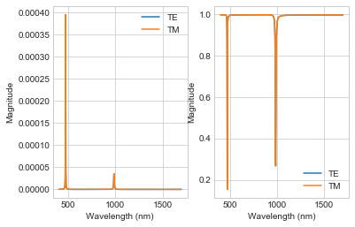
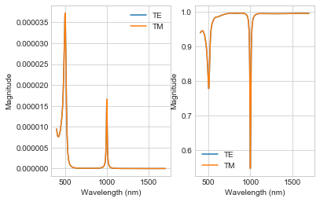
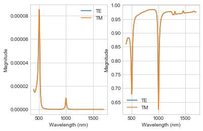

# transfer-matrix-method
Nanophotonics Transfer Matrix Solver

###### ELEC 856 Nanophotonics Assignment 1
###### Hugh Morison

This script builds the transfer matrix for the light incident on a multi-material slab and plots the reflection and 
transmission as a function of wavelength and incident angle for both TE and TM polarizations. 

Materials can be supplied to the sweep function in `main.py` or are supplied through the file `material_input.txt`,
where each line is of the form “[name],[thickness],[index]” where `name` and `thickness` are required, and `index` is only
required for materials not listed in `materials.INDICES`. You can always supply a value for the refractive index to use
a constant value (real or complex) across all wavelengths that will override the default for that material.

If a Material is either “gold” or “silver”, the first line of `material_input.txt` must be of the form “model=[model]”
where `model` is the name of the model to use for the optical properties of the material and must be one of the following:
* Drude
* Johnson
* Palik

The “Drude” model is a semi-analytical model for the permittivity, while the ”Johnson” and “Palik” models use 
complex refractive index values interpolated from the values in the books by (i) Johnson & Christy and (ii) Palik.

#### Example

The images above are plots of transmittance and reflectance for each of the models for a slab consisting of:
1. 50nm of Ag
2. 100nm of Si
3. 50nm of Au
4. 100nm of Ag
5. 50nm of SiO2

These can be compared to [results for the same stack](https://www.filmetrics.com/reflectance-calculator?wmin=400&wmax=1700&wstep=1&angle=0&pol=s&units=nm&mat[]=Air&d[]=0&mat[]=Ag&d[]=50&mat[]=Si&d[]=100&mat[]=Au&d[]=50&mat[]=Ag&d[]=100&mat[]=SiO2&d[]=50&mat[]=Air&d[]=0&sptype=r)
generated by an online application from Filmetrics.
